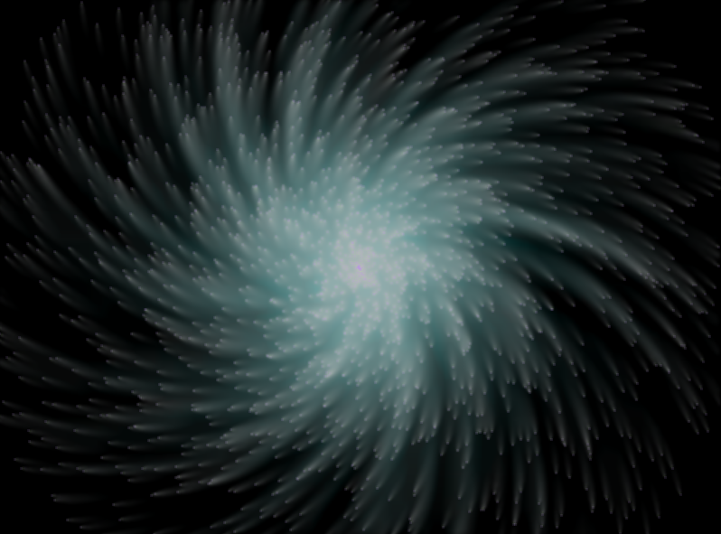

# particleAnimation
Just a cool animation of particles exploding in a big-bang style.

This project is a small demonstration of Object Oriented Programming in C++. Program is split in several class files, each for handling some aspect of program, and finally compiled and linked through Makefile.

#### Dependencies

* **g++**: It is the default C/CPP compiler for most linux systems. All linux systems have it preinstalled.
* **libsdl2-dev**: SDL is a C++ library that allows low level graphic access to programs. You need to install development version of SDL2. On Ubuntu/Debian you can use the command `sudo apt-get install libsdl2-dev` in your terminal (hit <kbd>Ctrl</kbd>+<kbd>Alt</kbd>+<kbd>T</kbd> to open).

#### Building and Execution

After you have satisfied the dependencies, download this reository and extract it. Open your terminal and change directory to this repository's directory and run `make` command. This will build the executable. Execute it using `./particleAnimation` command.

#### Screenshot

